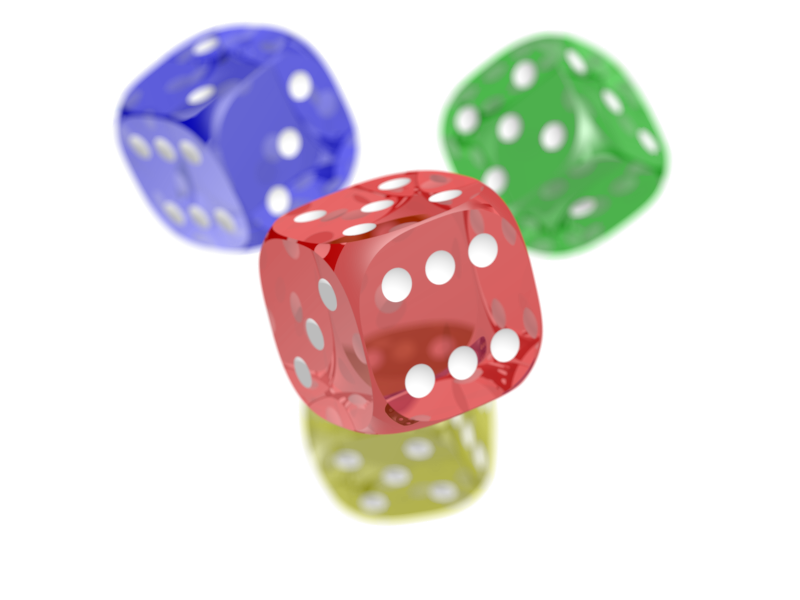

# Figures {#sec-figures}

::: {.callout-tip}

For full details and advanced options, see the [official Quarto Figures documentation](https://quarto.org/docs/authoring/figures.html):

:::

## Basic Figure
The example below creates:

- a numbered figure,
- a visible caption,
- alternative text for screen readers,
- a cross-reference target.

```markdown
{#fig-dice fig-alt="This is descriptive alt text"}

@fig-dice shows four multi-coloured dice.
```

{#fig-dice fig-alt="This is descriptive alt text"}

@fig-dice shows four multi-coloured dice.

::: {.callout-tip}

In Quarto, an image becomes a figure whenever it has a caption and appears by itself in a paragraph. 

:::


## Layout Options

### Size

```markdown
{#fig-dice fig-alt="This is descriptive alt text" width=20%}

{#fig-dice fig-alt="This is descriptive alt text" width=2cm}
```

{#fig-dice-20pc fig-alt="This is descriptive alt text" width=20%}

{#fig-dice-2cm fig-alt="This is descriptive alt text" width=2cm}


### Subfigures

Subfigures allow multiple related images to be grouped under a single figure number with individual sub-captions.

```markdown

::: {#fig-dice-layout layout-ncol=2}

{#fig-dice-left fig-alt="This is descriptive alt text"}

{#fig-dice-right fig-alt="This is descriptive alt text"}

Here is the main caption for the whole figure.
:::
```

::: {#fig-dice-layout layout-ncol=2}
{#fig-dice-left fig-alt="This is descriptive alt text"}

{#fig-dice-right fig-alt="This is descriptive alt text"}

Here is the main caption for the whole figure.
:::

Notes:

- Individual image captions become sub-captions.
- The final paragraph becomes the overall figure caption.
- **Blank lines between images and captions are required**.
- You can also create more custom layouts: `{layout-ncol=3}`, `{layout-nrow=2}` 

### Two Images Above One Wide Image


::: {.callout-note}

For brevity in the next few examples, I have just used pseduocode {{image.png}} to show where the image should be

:::


```markdown
::: {layout="[[1,1],[1]]"}

{{image1.png}}

{{image2.png}}

{{image3.png}}

:::
```

### Unequal Widths

```markdown
::: {layout="[[70,30],[100]]"}

{{large.png}}

{{small.png}}

{{full.png}}

:::
```

### Adding Space Between Elements

```markdown
::: {layout="[[40,-20,40],[100]]"}

{{left.png}}

{{right.png}}

{{bottom.png}}

:::
```

Negative values create spacing between items.

---

## Figures from code

Figures generated from Python, R, or Julia code are **automatically** treated as figures. See @sec-code-figs for examples

--- 

## Figure Divs 

Any content can be treated as a figure by enclosing it in a fenced div with an identifier beginning with `fig-`. This is useful for:

- embedded videos
- interactive visualisations
- HTML widgets
- custom content that is not a simple image


::: {.callout-important}

These only work for the HTML output and not PDF or Word. If you include a figure div, you should also include a fallback link to the resource in the caption to support the other output formats.

:::


```markdown
::: {#fig-video}

<iframe width="560" height="315" src="https://www.youtube.com/embed/EbAAmrB0luA?si=jYVDsTRDNb_8aj9X" title="YouTube video player" frameborder="0" allowfullscreen></iframe>

The final paragraph becomes the figure caption. You should include [link to the video here](www.youtube.com)

:::
```

::: {#fig-video}

<iframe width="560" height="315" src="https://www.youtube.com/embed/EbAAmrB0luA?si=EWEzd7JMH4GFdH1f" title="YouTube video player" frameborder="0" allow="accelerometer; autoplay; clipboard-write; encrypted-media; gyroscope; picture-in-picture; web-share" referrerpolicy="strict-origin-when-cross-origin" allowfullscreen></iframe>

The final paragraph becomes the figure caption. You should include [link to the video here](www.youtube.com)

:::

## Tikz figures


::: {.callout-warning}
## TO DO

Include link to Tikz examples.

See [quarto_tikz extension](https://github.com/danmackinlay/quarto_tikz)

:::

